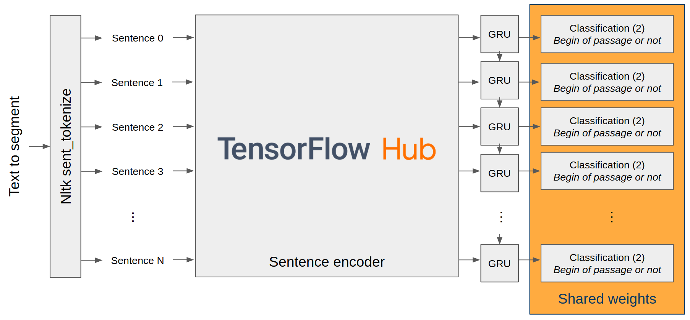

**To do:**
- [ ] Comment results
- [ ] Try others sentences embedding models or transformers models
- [ ] Create CNN dataset and compare results

# Text segmentation task on Wikinews and CNN data

Wikinews and CNN passages dataset and code to train a segmenter model to find passages segmentation from continuous text.

| Table of contents |
| ----------------- |
| [Dataset](#dataset) |
| [Task](#task) |
| [My Model](#my-model) |
| [Results](#results) |
| [Getting started](#getting-started) |
| [License](#license) |

## Dataset

### Wikinews

The dataset in composed of 18997 Wikinews articles segmented in passages according to the author of the news. All the data is in the ``wikinews.data.jsonl`` file ([download](https://drive.google.com/open?id=1E3mfjgL3Z-r8hNGXMrclsLTlBBEyYpFy)). The ``data/`` folder contains scripts to convert the ``.jsonl`` file into train and test files.

#### Reproduce the dataset

``wikinews.data.jsonl`` file is composed by an article per line. The article is saved in json format:

```
{"title": "Title of the article", "date": "Weekday, Month Day, Year", "passages": ["Passage 1.", "Passage 2.", ...]}
```

You can create your own ``wikinews.data.jsonl`` file by running the following command:

```
cd data/
python create_data.py --num 40000 \
                      --output "wikinews.data.jsonl"
```
*Remark: ``--num`` is the number of wikinews articles to use. The final number of data is less than this number because certain articles are depreciated*

#### Create train and test files

To make the training easier, I recommend to transform the ``wikinews.data.jsonl`` file into ``train.txt`` and ``test.data.txt`` and ``test.gold.txt`` by running the following command:

```
cd data/
python create_train_test_data.py --input "wikinews.data.jsonl" \
                                 --train_output "train.txt" \
                                 --test_data_output "test.data.txt" \
                                 --test_gold_output "test.gold.txt"
```

*Remark: 80/20 training/test split*

These files contain one sentence per line with the corresponding label (1 if the sentence is the beginning of a passage, 0 otherwise). The passages are segmented into sentences using `` sent_tokenize`` from the `` nltk`` library. Articles are separated by ``\n\n``. Sentences are separated by ``\n``. Elements of a sentence are separated by ``\t``.

```
Article 1
Sentence  1 Text of the sentence 1. label
Sentence  2 Text of the sentence 2. label
...

Article 2
Sentence  1 Text of the sentence 1. label
Sentence  2 Text of the sentence 2. label
...

...
```

``train.txt`` contains all elements of sentences.

``test.data.txt`` does not contain the label element of sentences.

``test.gold.txt`` does not contain the text element of sentences.


### CNN News

The dataset in composed of more than 93000 CNN news articles segmented in passages according to the author of the news. Stories are from the [DeepMind Q&A dataset](https://cs.nyu.edu/~kcho/DMQA/). All the data is in the ``cnn.data.jsonl`` file ([download](https://drive.google.com/open?id=1WzG7-LyQg7vlborMuUwhNPZfZfI8dQgX)). The ``data/`` folder contains scripts to convert the ``.jsonl`` file into train and test files.

#### Reproduce the dataset

``cnn.data.jsonl`` file is composed by an article per line. The article is saved in json format:

```
{"title": "", "date": "", "passages": ["Passage 1.", "Passage 2.", ...]}
```
*Remark: There was no title and date in the stories DeepMind Q&A dataset so the fields ``"title"`` and ``"date"`` are always empty. I leave them to have the same format that for ``wikinews.data.jsonl``.* 

To create ``cnn.data.jsonl``, you have first to download all stories [here](https://drive.google.com/uc?export=download&id=0BwmD_VLjROrfTHk4NFg2SndKcjQ) and extract the archive in the ``data/`` folder. Then you have to run:

```
cd data/
python create_data_cnn.py --directory path/to/the/stories/directory \
                      --output "cnn.data.jsonl"
```

#### Create train and test files

Same command that for Wikinews except change the input by ``cnn.data.jsonl``.

## Task

Given a continuous text composed a sentences S1, S2, S3, ..., the segmenter model has to find which sentences are the beginning of a passage. And so give in output a set of passages P1, P2, P3, ... composed by the sentences in the same order. 

The objective is that passages contain one information. In the best case passages are self-contained passages and do not require an external context to be understood. 

## My Model

The model is composed of a sentence encoder ([pre-trained sentence encoder from tf hub](https://tfhub.dev/google/universal-sentence-encoder-large/5) or [transformer from HuggingFace](https://huggingface.co/transformers/)) follows by a recurrent layer (simple or bidirectional) on each sentence and then a classification layer. 



## Results

### TF Hub sentence encoder and simple recurrent layer

The result and the model weight are obtained after a training with parameters :

  - ``learning_rate = 0.001``
  - ``batch_size = 12``
  - ``epochs = 8``
  - ``max_sentences = 64`` (Number max of sentences per article)

|  | Precision | Recall | Fscore |
| --- | ----------- | --- | ----------- |
| wikinews | 0.761 | 0.757 | 0.758 | 
| cnn | 0.0 | 0.0 | 0.0 | 

Saved weights of the model available [here](https://github.com/airKlizz/TextSegmentation/releases/download/v1.0-model.weights/segmenter.h5).


## Getting started

### Installation

#### Create a virtual environnement and activate it:

```
python3 -m venv textsegmentation_env
source textsegmentation_env/bin/activate
```


#### Install all dependencies:

```
pip install -r requirements.txt
```


#### Download data:

You can download the ``wikinews.data.jsonl`` file [here](https://drive.google.com/open?id=1E3mfjgL3Z-r8hNGXMrclsLTlBBEyYpFy) or the ``wikinews.data.jsonl`` file [here](https://drive.google.com/open?id=1WzG7-LyQg7vlborMuUwhNPZfZfI8dQgX). Otherwise you can recreate the ``data.jsonl`` file (See above). Then move the file to ``data/`` and run ``create_train_test_data.py`` with the correct ``--input`` (See [above](#create-train-and-test-files)).

### Training

[](https://colab.research.google.com/drive/1xGrA3zXgeSkltANMOXw55FyZpE0zfkdh#scrollTo=eR_q6FLoIf43)

```
python train.py --learning_rate 0.001 \
                --max_sentences 64 \
                --epochs 8 \
                --train_path "data/train.txt"
```

To see full usage of ``train.py``, run ``python train.py --help``.

*Remark: During training the accuracy can be very low. It is because the model does not train on padding sentences and so these padding sentences are not predicted well.*

### Evaluation

[](https://colab.research.google.com/drive/1PAb22GA_vCOb4kWLFva1-8mimkRwkQt0#scrollTo=sTPYIV1wdhyS)

### Use pre-trained models
[](https://colab.research.google.com/drive/1zio9edyZGBVH3bSU9dM05uqLjateE7ll#scrollTo=4Gs-MrT7BNxy)

## License
[MIT](https://choosealicense.com/licenses/mit/)
